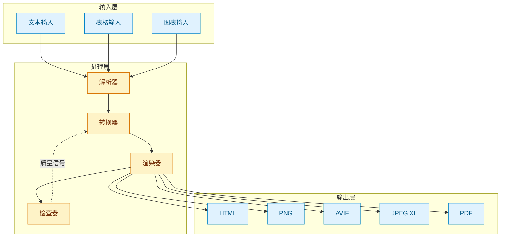
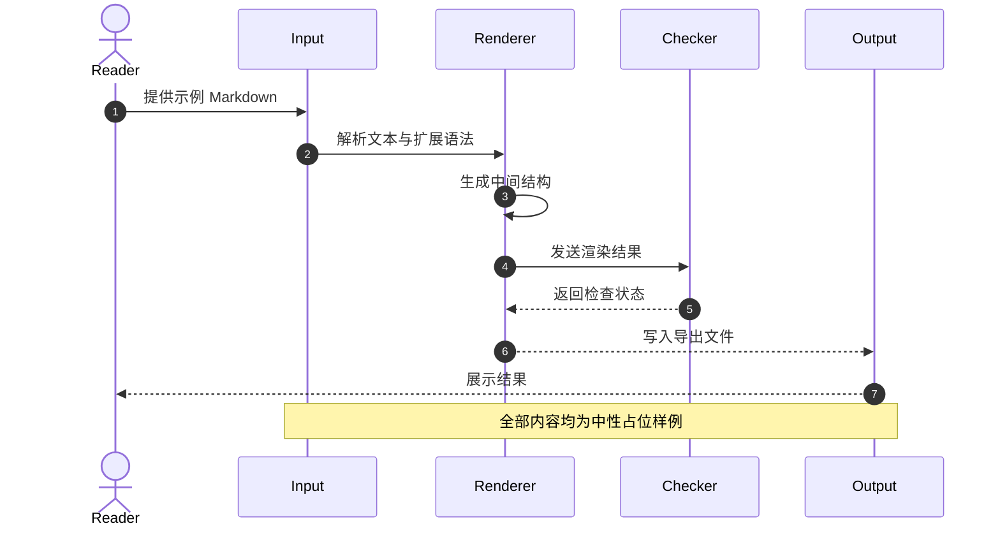
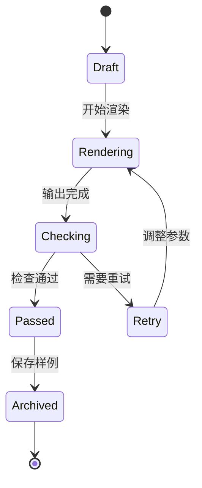
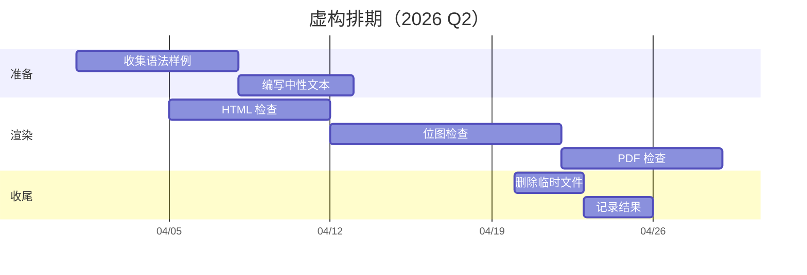
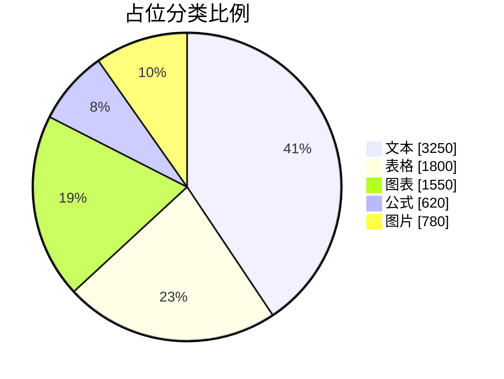
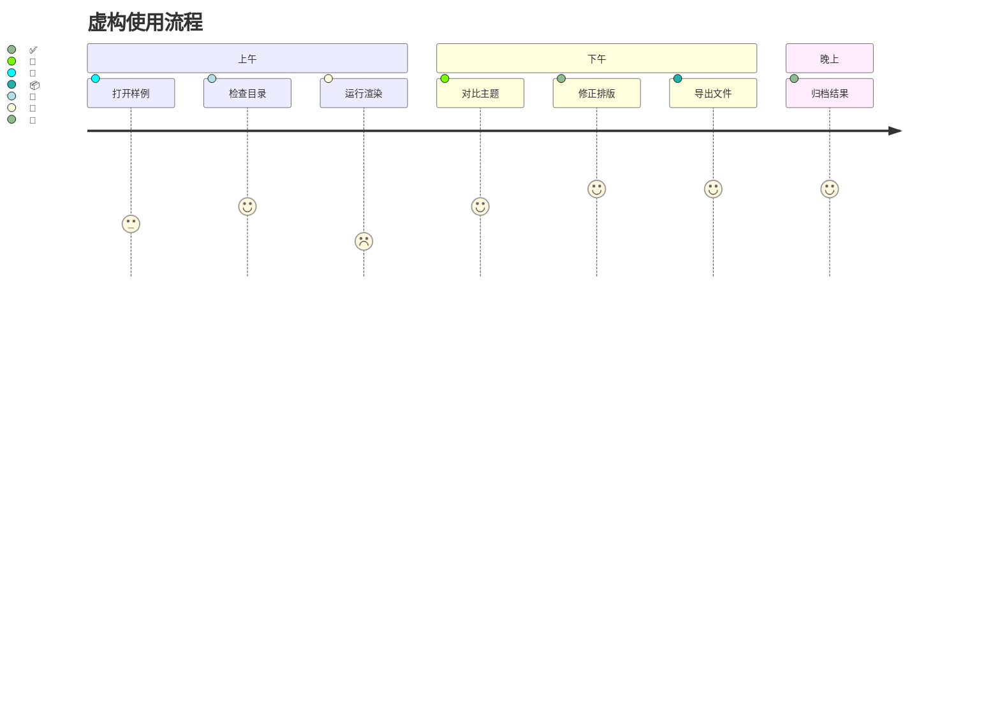
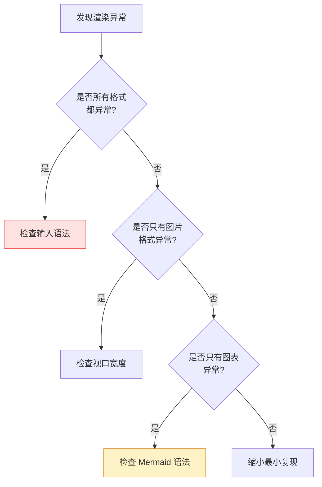

# md-render 中性综合样例 :rocket:

> **用途**：这是一个无实际业务含义的渲染自检样例，用来覆盖常规 Markdown、长文档、复杂表格、代码高亮、数学公式、Mermaid、容器、图片与安全模式边界。
>
> 所有名称、数值、流程和图表均为虚构占位内容，不代表任何现实对象。

## 目录 :bookmark_tabs:

1. [基础排版与行内语法](#1-基础排版与行内语法)
2. [列表、引用与任务项](#2-列表引用与任务项)
3. [表格压力测试](#3-表格压力测试)
4. [代码块与长行换行](#4-代码块与长行换行)
5. [数学公式 KaTeX](#5-数学公式-katex)
6. [Mermaid 图表集合](#6-mermaid-图表集合)
7. [容器、脚注与定义列表](#7-容器脚注与定义列表)
8. [图片、HTML 与安全模式边界](#8-图片html-与安全模式边界)
9. [长文档占位片段](#9-长文档占位片段)
10. [已知渲染检查清单](#10-已知渲染检查清单)

---

## 1. 基础排版与行内语法

支持 *斜体*、**粗体**、***粗斜体***、~~删除线~~、`行内代码`、==高亮==、H~2~O、E=mc^2^、[普通超链接](https://example.com)。

中英文混排压力：The quick brown fox 跳过了那只懒狗 The quick brown fox jumps over the lazy dog，多次重复用于测试中英文间距、标点和换行效果：中文，English，数字 12345，emoji :smile:，全角符号「测试」。

Emoji 测试：:smile: :+1: :tada: :fire: :sparkles: :rocket: :heart: :star: :zap: :warning: :white_check_mark: :x: ❤️ 🚀 🎉 🌈 🦄 🔥

超长行内代码测试：`const veryLongVariableName = await computeDisplayFixtureWithRetry(options, { timeout: 5000, retries: 3, backoff: 'exponential' })`

超长链接文字测试：[这是一个非常非常长的链接文字，用来测试链接在正文栏宽内的换行、点击区域、颜色和下划线表现是否符合预期](https://example.com/very/long/path/with/many/segments/and/query?param1=value1&param2=value2&param3=value3)。

裸 URL 与邮箱自动链接测试：https://example.com/path/to/resource?with=query&and=hash#section，team@example.com。

需要转义的 Markdown 字符：\*不是斜体\*、\`不是代码\`、\[不是链接\](https://example.com)。

一段包含超长英文单词的正文：pneumonoultramicroscopicsilicovolcanoconiosispneumonoultramicroscopicsilicovolcanoconiosis，用于测试不可断词内容是否撑破容器。

## 2. 列表、引用与任务项

- 无序列表项 A
  - 二级嵌套
    - 三级嵌套
      - 四级嵌套（测试深度缩进在正文区域内的表现）
- 无序列表项 B，文字较长，用于测试列表项中的文本换行：这是一段故意写得很长的文字 This is intentionally a very long line of text to test wrapping behavior in constrained content columns。
- [x] 已完成任务：准备样例输入
- [x] 已完成任务：生成中性表格
- [ ] 待办任务：检查暗色主题
- [ ] 待办任务：复核导出尺寸

1. 有序第一项
2. 有序第二项（带 **加粗** 与 `代码`）
3. 有序第三项
   1. 子项 3.1
   2. 子项 3.2
      - 混合无序子项
      - 第二个混合子项

> 这是一段引用：知者不博，博者不知。 —— 老子
>
> 多行引用：
> 第二行文字用于测试 `blockquote` 在不同主题下的左边框、背景色、文字缩进表现。
>
> > 嵌套引用用于测试多层 blockquote 的边距和颜色。

## 3. 表格压力测试

### 3.1 标准窄表

| 项目 | 编号 | 状态 |
| :--- | :---: | ---: |
| Alpha | 001 | ✅ ON |
| Beta | 002 | ⚠️ WARN |
| Gamma | 003 | ❌ OFF |

### 3.2 超宽表格（横向压力）

| 组件ID | 分组 | 类型 | 输入数量 | 输出类型 | 耗时(ms) | 容量(MB) | 权重 | 备注信息 |
| :--- | :--- | :--- | ---: | :--- | ---: | ---: | ---: | :--- |
| CMP-001 | 甲组 | Parser | 120 | JSON | 23 | 64 | 0.15 | 虚构组件，用于测试短备注 |
| CMP-002 | 甲组 | Renderer | 300 | HTML | 28 | 128 | 0.25 | 自动回退场景，占位说明 |
| CMP-003 | 乙组 | Normalizer | 80 | Text | 45 | 96 | 0.10 | 包含较长中文说明以测试换行 |
| CMP-004 | 乙组 | Exporter | 160 | PNG | 52 | 256 | 0.20 | 这里没有真实系统含义 |
| CMP-005 | 丙组 | Aggregator | 220 | CSV | 67 | 192 | 0.12 | 面向布局压力的虚构数据 |
| CMP-006 | 丙组 | Checker | 90 | Report | 145 | 512 | 0.08 | 数字列右对齐测试 |
| CMP-007 | 丁组 | Formatter | 40 | PDF | 210 | 384 | 0.10 | 末行边界与宽表滚动测试 |

### 3.3 长单元格与内联代码

| 字段 | 说明 |
| :--- | :--- |
| name | 条目的中文全称，例如「演示条目-甲组-主样例-001」 |
| marker | 虚构标记字符串，形如 `fixture-marker-abc-1234` |
| desc | 这里是一段较长的备注，用于测试单元格内文本的换行效果；内容没有实际业务含义，只用于检查宽度、行高和主题颜色 |
| keyboard | <kbd>⌘</kbd>+<kbd>⌥</kbd>+<kbd>F</kbd>、<kbd>Ctrl</kbd>+<kbd>Shift</kbd>+<kbd>P</kbd> |

## 4. 代码块与长行换行

### 4.1 Bash

```bash
printf '%s\n' "alpha,beta,gamma" | tr ',' '\n' | nl -ba | sed 's/^/fixture-row-/' | head -10
```

### 4.2 JavaScript（含超长单行）

```js
// 这是一个故意写得很长的单行代码，用来测试在位图或 PDF 中的硬换行、↩ 标识和截断表现
const result = await Promise.all(items.map(async (item) => ({ id: item.id, group: item.group, score: await computeScore(item.value, { timeout: 5000, retries: 3, backoff: 'exponential', jitter: true, tags: ['fixture', 'long-line', 'wrap-test'] }) })));

function fibonacci(n) {
  if (n < 2) return n;
  const memo = new Map([[0, 0], [1, 1]]);
  const fib = (k) => {
    if (memo.has(k)) return memo.get(k);
    const v = fib(k - 1) + fib(k - 2);
    memo.set(k, v);
    return v;
  };
  return fib(n);
}

console.log('fib(20) =', fibonacci(20));
```

### 4.3 Go（包含 `lo` 与中文注释）

```go
package fixture

import (
    "math"
    "time"

    "github.com/samber/lo"
)

type Item struct {
    ID        string
    Group     string
    Value     float64 // 原始分值
    LoadRatio float64 // [0,1]
    Weight    float64 // 相对权重
    ReadyRate float64 // [0,1]
    UpdatedAt time.Time
}

type Weights struct {
    Alpha, Beta, Gamma, Delta float64
}

// Score 返回综合分数，数值越低代表越适合作为样例候选。
func Score(item Item, w Weights, baseline float64) float64 {
    return w.Alpha*(item.Value/baseline) +
        w.Beta*item.LoadRatio +
        w.Gamma*item.Weight +
        w.Delta*(1.0-item.ReadyRate)
}

// Pick 从候选里选分数最小者；全部不满足条件时返回 ok=false。
func Pick(items []Item, w Weights, now time.Time) (Item, bool) {
    candidates := lo.Filter(items, func(item Item, _ int) bool {
        return item.ReadyRate > 0.5 && now.Sub(item.UpdatedAt) < 30*time.Second
    })
    if len(candidates) == 0 {
        return Item{}, false
    }
    scored := lo.Map(candidates, func(item Item, _ int) lo.Tuple2[Item, float64] {
        return lo.T2(item, Score(item, w, 100.0))
    })
    best := lo.MinBy(scored, func(a, b lo.Tuple2[Item, float64]) bool {
        return a.B < b.B
    })
    return best.A, true
}

func sane(w Weights) bool {
    sum := w.Alpha + w.Beta + w.Gamma + w.Delta
    return math.Abs(sum-1.0) < 1e-6
}
```

### 4.4 Python（多行复杂逻辑）

```python
# 异步并发处理 + 重试 + 限流，用于测试 Python 高亮与长类型标注
import asyncio
from dataclasses import dataclass
from typing import Optional

@dataclass
class TaskResult:
    name: str
    status: int
    body: Optional[str] = None
    error: Optional[str] = None

async def process_one(worker, name: str, sem: asyncio.Semaphore, retries: int = 3) -> TaskResult:
    async with sem:
        for attempt in range(retries):
            try:
                text = await worker.run(name, timeout=10)
                return TaskResult(name=name, status=0, body=text[:200])
            except Exception as exc:
                if attempt == retries - 1:
                    return TaskResult(name=name, status=-1, error=str(exc))
                await asyncio.sleep(2 ** attempt)
```

### 4.5 SQL、Diff、Dockerfile、YAML 与纯文本

```sql
-- 查询最近 30 天各分组的 P95 数值与可用率
WITH item_stats AS (
  SELECT item_id, group_name, DATE_TRUNC('day', measured_at) AS day,
         PERCENTILE_CONT(0.95) WITHIN GROUP (ORDER BY value_ms) AS p95_value,
         AVG(CASE WHEN status = 'ok' THEN 1.0 ELSE 0.0 END) AS availability
  FROM fixture_measurements
  WHERE measured_at >= NOW() - INTERVAL '30 days'
  GROUP BY item_id, group_name, DATE_TRUNC('day', measured_at)
)
SELECT item_id, group_name, ROUND(AVG(p95_value)::numeric, 2) AS avg_p95_ms
FROM item_stats
GROUP BY item_id, group_name
ORDER BY avg_p95_ms ASC
LIMIT 20;
```

```diff
  section "fixture" {
-     value = "old-placeholder"
+     value = "new-placeholder"
  }
```

```dockerfile
FROM alpine:3.20
RUN apk add --no-cache ca-certificates tini && \
    addgroup -S app && adduser -S -G app app
USER app
ENTRYPOINT ["tini", "--"]
```

```yaml
global:
  scrape_interval: 15s
  external_labels:
    env: fixture
    shard: "demo-1"
```

```
这是一段没有指定语言的代码块，用于测试默认样式。
ASCII 表格也可以放进来：
+----------+----------+
| 列 A     | 列 B     |
+----------+----------+
| 值 1     | 值 2     |
+----------+----------+
```

~~~~markdown
这个代码块内部包含三反引号：
```js
console.log('nested fence');
```
~~~~

## 5. 数学公式 KaTeX

行内：$E = mc^2$，欧拉恒等式：$e^{i\pi} + 1 = 0$，二项式系数 $\binom{n}{k} = \frac{n!}{k!(n-k)!}$。

块级 · 高斯积分：

$$
\int_{-\infty}^{\infty} e^{-x^2} \, dx = \sqrt{\pi}
$$

块级 · 方程组：

$$
\begin{aligned}
a + b &= c \\
x + y &= z \\
\alpha + \beta + \gamma &= 1
\end{aligned}
$$

块级 · cases 与矩阵：

$$
f(x)=
\begin{cases}
0, & x < 0 \\
x^2, & 0 \le x < 1 \\
\sqrt{x}, & x \ge 1
\end{cases}
\quad
\begin{bmatrix} a & b \\ c & d \end{bmatrix}
\begin{bmatrix} x \\ y \end{bmatrix}
=
\begin{bmatrix} ax + by \\ cx + dy \end{bmatrix}
$$

块级 · 长公式换行：

$$
(\alpha^*, \beta^*, \gamma^*, \delta^*) = \underset{\alpha+\beta+\gamma+\delta=1}{\arg\min} \; \mathbb{E}_{u \sim \mathcal{U}} \left[ \ell^{\text{p95}}_{u} \right] + \mu \cdot \text{Cost}
$$

## 6. Mermaid 图表集合

### 6.1 流程图（含 `<br/>` 标签与 classDef）


### 6.2 架构图（subgraph、虚线、多个分组）



### 6.3 时序图（autonumber 与 Note）



### 6.4 状态图



### 6.5 甘特图（检查轴线与末行间距）



### 6.6 Pie 与 Journey





### 6.7 排障决策树



## 7. 容器、脚注与定义列表

:::tip 友情提示
这是一个 **tip** 容器，渲染为彩色提示框，内部可包含 *其他* 语法：
- 列表项 1
- 列表项 2
- `行内代码`
:::

:::warning 操作警告
注意：这里的操作只是虚构示例。多行提示内容用于测试容器的高度自适应：
1. 第一步：准备输入
2. 第二步：执行渲染
3. 第三步：查看结果
:::

:::danger 危险操作
此处只是用于测试危险提示块的视觉样式，不对应真实操作。
:::

:::info 信息提示
`info` 容器用于普通说明，测试与 `tip` 的颜色区分。
:::

:::note 备注
`note` 容器用于补充上下文，测试默认容器样式。
:::

这里有个脚注[^1]，再来一个命名脚注[^note]，还有第三个脚注[^third]。

[^1]: 第一个脚注内容，用于测试脚注渲染位置。
[^note]: 命名脚注也可以，并且支持较长的脚注正文，测试换行。
[^third]: 第三个脚注，包含 `行内代码` 和 [链接](https://example.com)。

Fixture
:   用于测试渲染效果的固定输入样例。

Baseline
:   用于比较输出变化的参考结果。
:   这里没有真实业务含义，只是定义列表的第二段说明。

Slug
:   标题转换成锚点时使用的稳定标识。

## 8. 图片、HTML 与安全模式边界

### 8.1 图片

远程图片，用于测试普通 Markdown 图片、宽图缩放和 alt 文本：


Data URL 图片用于测试可信模式与安全模式差异；`--safe` 下应阻止高风险 data URL：


### 8.2 原始 HTML

下面这些 HTML 用于测试可信模式与 `--safe` 的差异：

<details>
<summary>点击展开原始 HTML 块</summary>

<p>这里有 <strong>strong</strong>、<em>em</em>、<code>code</code>、<kbd>⌘</kbd>+<kbd>K</kbd>。</p>

</details>

<small>文档生成：<time>2026-05-08</time> · 版本 v2.0.0 · License CC-BY-SA 4.0</small>

脚本标签只作为危险内容示例展示，避免可信模式打开样例时自动执行：

```html
<script>alert('safe mode should escape this script');</script>
```

危险链接测试： [javascript link](javascript:alert('xss'))。

## 9. 长文档占位片段

### 9.1 背景与目标

这个章节模拟一段较长的说明文档，但内容完全使用虚构的组件、流程和指标。它的目的不是描述真实业务，而是制造足够多的标题、段落、表格、列表和公式，方便检查长图、PDF 与目录渲染。

当前样例假设有一组虚构组件需要被整理成报告：

- :white_check_mark: 输入格式稳定，便于重复渲染
- :white_check_mark: 表格列数较多，便于观察宽表布局
- :white_check_mark: 图表类型丰富，便于覆盖 Mermaid 预渲染
- :warning: 某些段落故意较长，用于检查换行与分页边界
- :x: 不包含可指向现实对象的配置或身份信息

目标（虚构）：

| 编号 | 目标（Objective） | 关键结果（Key Results） | 截止 |
| :---: | :--- | :--- | :---: |
| O1 | 保持样例中性 | KR1: 不出现真实服务名；KR2: 不出现环境路径 | Q2 |
| O2 | 覆盖渲染语法 | KR1: 覆盖表格；KR2: 覆盖 Mermaid；KR3: 覆盖 KaTeX | Q2 |
| O3 | 降低维护成本 | KR1: 数据短小；KR2: 文本易读；KR3: 便于 grep 检查 | Q3 |
| O4 | 提升可复现性 | KR1: 输出稳定；KR2: 输入无外部依赖 | Q3 |

### 9.2 成本分析（虚构）

月度总成本 $C_{\text{total}}$ 由 **固定** 与 **变动** 两部分组成：

$$
C_{\text{total}} = \underbrace{\sum_{i=1}^{k} F_i}_{\text{固定项}} + \underbrace{\sum_{i=1}^{k} p_i \cdot V_i}_{\text{变量项}} + \underbrace{C_{\text{ctrl}}}_{\text{控制项}} + \underbrace{C_{\text{ops}}}_{\text{维护项}}
$$

| 条目 | 固定值 | 单价 | 数量 | 变量值 | 小计 |
| :--- | ---: | ---: | ---: | ---: | ---: |
| ITEM-01 | 180 | 0.0000 | 4.80 | 0 | **180** |
| ITEM-02 | 150 | 0.0050 | 3.20 | 16 | **166** |
| ITEM-03 | 120 | 0.0080 | 2.40 | 20 | **140** |
| ITEM-04 | 95 | 0.0060 | 3.60 | 22 | **117** |
| ITEM-05 | 130 | 0.0100 | 1.20 | 12 | **142** |
| **合计** | **675** | — | **15.20** | **70** | **745** |

### 9.3 虚构问题复盘

> **时间**：2026-05-08 10:00
> **影响**：样例渲染中某个长单元格换行不符合预期
>
> **Triage**
>
> 1. 观察输出文件中宽表的列宽
> 2. 对比浅色主题与深色主题的差异
>
> **Mitigate**
>
> - 缩短非必要文本
> - 增加专门的长行样例
>
> **Postmortem**
>
> - :white_check_mark: 最小复现已加入样例
> - :x: 旧样例内容过于具体，容易让人误解为真实资料
> - :bulb: 动作项：保持 fixture 中性、可公开、无实际业务指向

## 10. 已知渲染检查清单

- [x] **YAML frontmatter**：应被剥离，不应在正文顶部渲染 `title:` / `author:`。
- [x] **长代码行**：位图/PDF 应按 `--wrap-code-column auto` 实测列宽硬换行，并保留 `↩` 标识。
- [x] **KaTeX 下沿裁切**：块级公式需要有足够 vertical padding。
- [x] **Standalone HTML 体积**：有公式时应使用 MathJax SVG 路径，避免内联大量 KaTeX 字体。
- [x] **Mermaid Gantt**：X 轴 tick 文字不能压住最后一个 section。
- [x] **Mermaid Journey**：预渲染 SVG 的 viewBox 不应留下巨大空白。
- [x] **Twemoji**：Unicode emoji 与 `:shortcode:` 都应跨平台稳定显示。
- [x] **安全模式**：`--safe` 应转义原始 HTML、拦截 `javascript:` 与 data URL 图片。
- [x] **本地 / 远程图片**：宽图应自适应容器，不能撑破页面。
- [x] **表格**：宽表、长单元格、右对齐数字列都应保持可读。
- [x] **脚注与定义列表**：长文档底部脚注不应破坏整体排版。
- [x] **Raw HTML inline**：`kbd`、`small`、`time` 在可信模式可用，在安全模式应按策略处理。

---

文档结束 ✨ · 以上内容只用于 Markdown 渲染测试，不包含可指向现实对象的信息。
